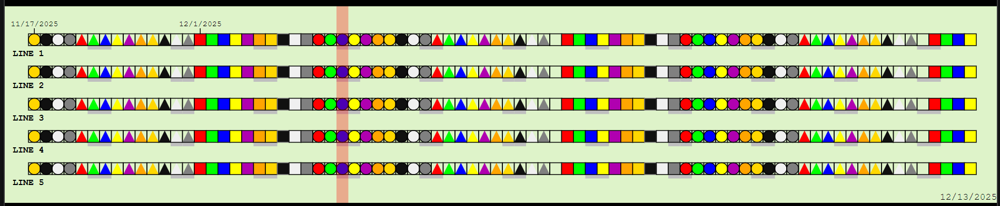

# Avalonia Timeline Control

A powerful timeline visualization control for Avalonia applications, ported from the TypeScript Timeline.ts component.




## Features

- **Multiple Timeline Rows**: Display 1-10 parallel timeline rows with customizable labels
- **30 Chicklet Styles**: Combine 10 colors with 3 shapes (Box, Circle, Triangle)
- **Date-based Navigation**: Mouse wheel and keyboard support for scrolling through dates
- **Interactive Events**: Click and hover events with metadata support
- **Weekend Highlighting**: Visual indicators for weekends
- **Month Transitions**: Automatic labeling of month boundaries
- **Overlap Detection**: Dog-ear indicators when multiple items occupy the same date
- **Test Render Mode**: Built-in visualization for all chicklet styles
- **Fully Customizable**: Adjust day size, margins, colors, spacing, and more
- **Color Customization**: Customize background, line, and dog ear colors
- **Font Styling**: Bold or normal font weight for line labels

## Project Structure

```
AvaloniaTimeLineControl/
├── TimeLineControl/              # Control library
│   ├── Models/
│   │   ├── ChickletStyles.cs
│   │   ├── TimeLineDataItem.cs
│   │   ├── DateClickedEventArgs.cs
│   │   └── DateHoveredEventArgs.cs
│   ├── TimeLineControl.axaml
│   ├── TimeLineControl.axaml.cs
│   └── TimeLineControl.csproj
├── TimeLineControl.Demo/         # Demo application
│   ├── MainWindow.axaml
│   ├── MainWindow.axaml.cs
│   ├── App.axaml
│   ├── App.axaml.cs
│   ├── Program.cs
│   └── TimeLineControl.Demo.csproj
└── TimeLineControl.sln
```

## Getting Started

### Prerequisites

- .NET 8.0 SDK or later
- Avalonia 11.2.2 or later

### Building the Project

```bash
cd AvaloniaTimeLineControl
dotnet restore
dotnet build
```

### Running the Demo

```bash
cd TimeLineControl.Demo
dotnet run
```

## Usage

### Basic Setup

1. Add a reference to the TimeLineControl library in your Avalonia project:

```xml
<ItemGroup>
  <ProjectReference Include="..\TimeLineControl\TimeLineControl.csproj" />
</ItemGroup>
```

2. Add the namespace in your XAML:

```xml
xmlns:tl="clr-namespace:TimeLineControl;assembly=TimeLineControl"
```

3. Add the control to your window:

```xml
<tl:TimeLineControl x:Name="Timeline" Height="250" />
```

### Adding Data

```csharp
using TimeLineControl.Models;

// Create a data item
var item = new TimeLineDataItem(
    lineId: 1,                                    // Line/row number (1-based)
    renderStyle: ChickletStyles.Chicklet_BlueBox, // Visual style
    beginDate: new DateTime(2021, 4, 1),          // Start date
    endDate: new DateTime(2021, 4, 30),           // End date
    metaData: "Project Alpha"                     // Tooltip/metadata
);

// Add to timeline
Timeline.AddDataItem(item);
```

### Handling Events

```csharp
// Subscribe to events
Timeline.DateClicked += OnDateClicked;
Timeline.DateHovered += OnDateHovered;

private void OnDateClicked(object? sender, DateClickedEventArgs e)
{
    Console.WriteLine($"Clicked: {e.DateClicked:yyyy-MM-dd} on Line {e.LineClicked}");
    Console.WriteLine($"Metadata: {e.MetaData}");
}

private void OnDateHovered(object? sender, DateHoveredEventArgs e)
{
    Console.WriteLine($"Hovering: {e.DateHovered:yyyy-MM-dd} on Line {e.LineHovered}");
}
```

### Customizing the Timeline

```csharp
// Configure appearance
Timeline.NumRows = 5;              // Number of timeline rows (1-10)
Timeline.DaySize = 15;             // Width of each day in pixels
Timeline.Margin = 30;              // Border margin
Timeline.MarginScale = 1.5;        // Top margin scale factor
Timeline.StartDate = DateTime.Now; // Visible start date
Timeline.DateHeaderHeight = 25;    // Space above first line for date labels
Timeline.DateLabelLeftMargin = 20; // Left margin for date labels

// Customize colors
Timeline.BackgroundColor = Color.Parse("#DEF3C9");  // Background color
Timeline.LineColor = Color.Parse("#000000");        // Main line color (black)
Timeline.LineColorLight = Color.Parse("#7f7f7f");   // Light line color (gray)
Timeline.DogEarColor = Color.Parse("#ff99ff");      // Dog ear overlap indicator

// Customize line labels
Timeline.SetLineLabel(0, "Project A");
Timeline.SetLineLabel(1, "Project B");
Timeline.SetLineLabel(2, "Project C");
Timeline.LineLabelsBold = true;    // Render line labels in bold font

// Enable test render mode (shows all chicklet styles)
Timeline.TestRender = true;
```

### Available Chicklet Styles

The control supports 30 different visual styles:

**Boxes**: RedBox, GreenBox, BlueBox, YellowBox, PurpleBox, OrangeBox, GoldBox, BlackBox, WhiteBox, GreyBox

**Circles**: RedCircle, GreenCircle, BlueCircle, YellowCircle, PurpleCircle, OrangeCircle, GoldCircle, BlackCircle, WhiteCircle, GreyCircle

**Triangles**: RedTriangle, GreenTriangle, BlueTriangle, YellowTriangle, PurpleTriangle, OrangeTriangle, GoldTriangle, BlackTriangle, WhiteTriangle, GreyTriangle

### Managing Data

```csharp
// Clear all data
Timeline.ClearAllDataItems();

// Clear specific line
Timeline.ClearSpecificLine(lineId: 1);

// Navigate dates
Timeline.StartDate = Timeline.StartDate.AddDays(7); // Forward 1 week
```

## API Reference

### Properties

| Property | Type | Default | Description |
|----------|------|---------|-------------|
| NumRows | int | 5 | Number of timeline rows (1-10) |
| DaySize | double | 15 | Width of each day cell in pixels |
| Margin | double | 30 | Border margin around the control |
| MarginScale | double | 1.5 | Scale factor for top margin |
| DateHeaderHeight | double | 25 | Space above first line for date labels |
| DateLabelLeftMargin | double | 20 | Left margin to make room for date labels |
| StartDate | DateTime | DateTime.Now | First visible date on the timeline |
| TestRender | bool | false | Enable test mode showing all styles |
| LineLabelsBold | bool | true | Render line labels in bold font |
| BackgroundColor | Color | #DEF3C9 | Background color of the control |
| LineColor | Color | #000000 | Main line color (black) |
| LineColorLight | Color | #7f7f7f | Light line color used for borders (gray) |
| DogEarColor | Color | #ff99ff | Color of dog ear overlap indicators |
| LineLabels | IReadOnlyList<string> | - | Read-only list of line labels |

### Methods

| Method | Description |
|--------|-------------|
| AddDataItem(TimeLineDataItem) | Add a data item to the timeline |
| ClearAllDataItems() | Remove all data items |
| ClearSpecificLine(int lineId) | Remove all items from a specific line |
| SetLineLabel(int lineId, string label) | Set the label for a line |
| GetLineLabel(int lineId) | Get the label for a line |

### Events

| Event | EventArgs | Description |
|-------|-----------|-------------|
| DateClicked | DateClickedEventArgs | Fires when a date cell is clicked |
| DateHovered | DateHoveredEventArgs | Fires when hovering over a date cell |

## Differences from Original TypeScript Version

- Uses Avalonia's DrawingContext instead of HTML Canvas
- DateTime instead of JavaScript Date
- Routed events instead of DOM events
- Strongly typed with C# enums and classes
- XAML-based control definition
- Native .NET event handling

## License

This control is ported from the original Timeline.ts implementation.

## Contributing

Contributions are welcome! Please feel free to submit issues or pull requests.
